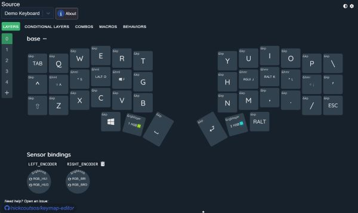
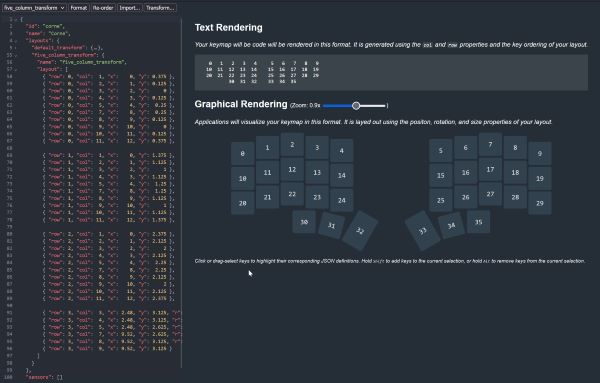
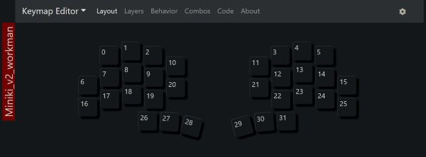
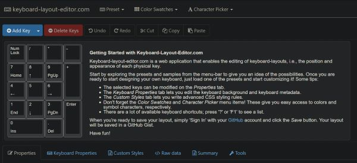

# splitkeyboard

## Decidido
- Split wifi + Dongle
- Layout do Totem com 1 tecla a mais e encoder nos 2 lados
- Topo de acrilico/policarbonato para fixar as switches
- Placa Seeed XIAO nR.... BLE
- Encoders tipo de mouse
- Sem LEDs para efeitos
- Utilizar o LED da placa para informar layers, etc

## Fazer
- Organizar matriz
- Tentar adicionar encoder

## Decidir
- Distribuição das teclas, macros, layers, etc
- Bateria de 200mAh?
- Posição da placa, bateria e encoder?
- Formato geral
- Madeira, 3d print ou uma segunda placa de acrilico?

## Descobrir
- Como controlar o LED da placa?
- É possivel adicionar switches e outros comandos no dongle?

## Links úteis
### Layouts
#### Keymap Editor - Nick Coutsos
  

#### Keymapper - Theo Therone
  
#### Keyboard Layout Editor - Ian Prest
  
https://config.qmk.fm/#/controllerworks/mini36/LAYOUT_split_3x5_3  
https://jhelvy.shinyapps.io/splitkbcompare/  
https://docs.google.com/spreadsheets/d/1R7HbWlUToqxME6spGiBuv7GGNC4VNMBPdS0U9fEQ7Ig/edit#gid=0  
https://aposymbiont.github.io/split-keyboards/  
https://github.com/diimdeep/awesome-split-keyboards  
https://golem.hu/boards/  
https://kbd.news/The-Mosquito-1026.html  
https://golem.hu/board/Parergon-V2-477.html  
https://github.com/yunjieshi/ya36  
https://kbfirmware.com/  
https://en.key-test.ru/  
https://keyboardchecker.com/  

### Discussão interessante sobre NFC pins e encoder
https://www.reddit.com/r/olkb/comments/11hl7is/extra_gpio_on_seeed_xiao_controllers_via_zmk/

### XIAO
https://files.seeedstudio.com/wiki/XIAO/Seeed-Studio-XIAO-Series-SOM-Datasheet.pdf  
https://www.printables.com/model/522586-seeed-xiao-ble-case  

### Totem
https://github.com/leandrosly/splitkeyboard-totem  
https://github.com/GEIGEIGEIST?tab=repositories  
https://www.youtube.com/watch?v=YwsutNf1WRA  
https://www.hackster.io/geist/totem-a-tiny-splitkeyboard-with-splay-cb2e43  

### ZMK
https://zmk.dev/docs  
https://github.com/zmkfirmware  
https://precondition.github.io/home-row-mods  
https://github.com/ebastler/zmk-designguide  

### Leeloo
https://clicketysplit.ca/pages/leeloo  
https://github.com/zmkfirmware/zmk/tree/main/app/boards/shields/leeloo  

### M4 2x2 Lego (Xiao encoder)
https://mlego.elena.space/m4/#m4-2x2-in-lego  
https://github.com/alinelena/mlego-zmk  

### Faw36 (Xiao encoder)
https://github.com/Germain-Gadel/faw36  
https://github.com/Germain-Gadel/zmk-config-faw36  

### Klein (Xiao encoder)
https://www.hackster.io/nosnk/klein-a-wireless-ergonomical-keyboard-b4cd9a  
https://github.com/snsten/Klein  
https://github.com/snsten/Klein-zmk  

### Corne-Xiao (encoder)
https://github.com/friction07/corne-xiao  

### Xodobox (xiao encoder)
https://www.hackster.io/seanqinxiao/xobdox-a-40-ish-split-wireless-keyboard-f7e3a8  

### Void Ergo
https://github.com/victorlucachi/void_ergo  

### Steno
https://www.openstenoproject.org/plover/  
https://github.com/qmk/qmk_firmware/blob/master/docs/feature_stenography.md  

### Hot Swap
https://github.com/stingray127/handwirehotswap  

### Matrix switches
https://summivox.wordpress.com/2016/06/03/keyboard-matrix-scanning-and-debouncing/  
(https://web.archive.org/web/20180711011642/https://summivox.wordpress.com/2016/06/03/keyboard-matrix-scanning-and-debouncing/)  
https://www.youtube.com/watch?v=975CS27w16w  

### Typing Practice
https://monkeytype.com/  
https://10fastfingers.com/typing-test/english  
https://www.keybr.com/  

### Amazon UK
[Ranked Gateron ks-27 Low Profile Key Switches for Mechanical Gaming Keyboards | Plate Mounted (Gateron Brown, 65 Pcs) )](https://www.amazon.co.uk/Gateron-ks-27-Switches-Mechanical-Keyboards/dp/B09WYJC2GY/ref=sr_1_20?crid=24QOBAFE4WPQ2&keywords=mechanical%2Bswitches&qid=1698319714&sprefix=mechanical%2Bswitches%2Caps%2C301&sr=8-20&th=1)  
[Key Low Optical Switch 87 pcs Brown | Z22](https://www.amazon.co.uk/Keychron-Low-Profile-Optical-Orange-Switch/dp/B09F94YH4D/ref=sr_1_19?crid=F07CZDDULZZW&keywords=low%2Bprofile%2Bswitch&qid=1698321583&sprefix=low%2Bprofile%2Bswit%2Caps%2C366&sr=8-19&th=1)  
